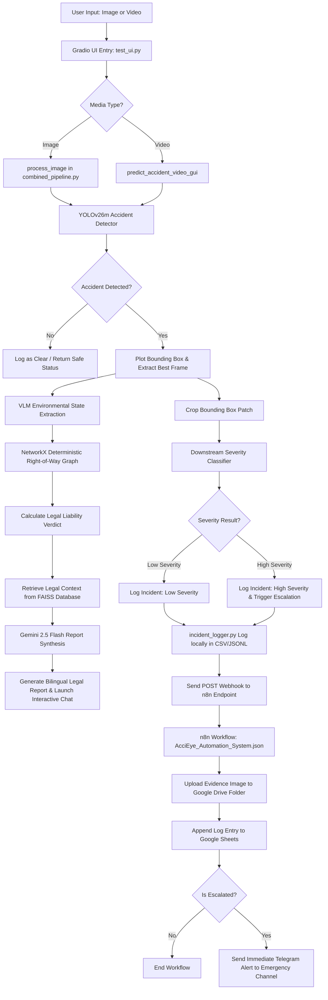

# AcciEye: Automated Traffic Accident Detection, Severity Classification, and Liability Reasoning System

AcciEye is an end-to-end, multi-stage artificial intelligence and automation platform. It is designed to detect traffic accidents from visual feeds, classify their severity, analyze legal liability using deterministic right-of-way logic based on Jordanian Traffic Law, synthesize formal bilingual legal reports, and automate emergency alerts.

---

## 📖 System Overview

Traditional computer vision or large language model (LLM) pipelines struggle in high-stakes domain-specific applications like traffic accident analysis. Visual detection systems lack semantic and legal understanding, while standard LLMs are prone to hallucinating right-of-way in complex spatial configurations. Traffic laws operate on strict hierarchical and relational rules, which cannot be modeled accurately by simple semantic retrieval (RAG).

**AcciEye** addresses this by employing a hybrid architecture combining:
1. **Object Detection**: High-accuracy object detection using a customized `YOLOv26m` architecture to detect and localize accidents.
2. **Severity Classification**: A secondary image patch classifier to evaluate the physical impact of the crash as either "Low" or "High" severity.
3. **Deterministic Legal Reasoning**: A directed knowledge graph (`NetworkX`) that models the priority hierarchies of Jordanian Traffic Law (Traffic Officers > Traffic Lights > Traffic Signs > Road Markings > Default Road Rules) to calculate a mathematically proven fault verdict.
4. **Knowledge-Augmented Generation (KAG)**: A legal retrieval-augmented synthesis stage combining local vector retrieval (`FAISS`) over bilingual (Arabic and English) Public Security Directorate (PSD) traffic manuals with `Gemini 2.5 Flash` to produce detailed, formal legal liability reports.
5. **Automated Notification Workflows**: An incident webhook dispatcher connected to an `n8n` automation system that logs accident records in Google Sheets, archives evidence in Google Drive, and routes immediate alert notifications to emergency channels via Telegram.

---

## 🛠️ System Architecture & Key Modules

The AcciEye platform is divided into four highly integrated modules:

### 1. Computer Vision & Object Detection (`modelling/`)
This module handles the perception stage of the pipeline.
* **Core Model**: Uses an optimized `YOLOv26m` single-class object detector trained on the annotated `data_processed` dataset.
* **Configurations**: Handled by `modelling/config.py`, which supports smoke testing and full hyperparameter sweep experiments.
* **Inference Pipeline**: `modelling/ui_app/combined_pipeline.py` consumes uploaded images or video streams, extracts frame-level representations, and generates localization bounding boxes for any detected accidents.

### 2. Severity Classification (`Classification/`)
* **Core Model**: A customized YOLO classification network located under `Classification/best_severity_classifier`.
* **Mechanism**: Once the object detector localizes an accident, the highest-confidence bounding box is cropped. This patch is routed to the classification network to evaluate whether the crash severity is `Low` or `High`. If the bounding box cropping fails, the system falls back to processing the full frame.

### 3. TALE Intelligence Module (`accident_agent/`)
The **Traffic Accident Liability Engine (TALE)** represents the cognitive and legal reasoning layer of the platform.
* **Deterministic Legal Graph**: Defined in `accident_agent/app/core/graph_logic.py`, the system maps the priority rules of Jordanian Traffic Law into a directed graph. Node A pointing to Node B represents that Node A yields right-of-way to Node B. By checking path existence (`nx.has_path`), the graph mathematically determines who violated right-of-way without relying on LLM reasoning.
* **FAISS Vector Database**: Created by `accident_agent/rag_ingest.py` using PDFPlumber to semantically parse the Arabic and English PSD Traffic Manuals. A custom regex chunker preserves Arabic-Indic numeric formatting (e.g. ١. , ١٫١.) to keep legal context intact. Text is indexed into an in-memory `FAISS` database using the multilingual `paraphrase-multilingual-MiniLM-L12-v2` Sentence-Transformer embedding model.
* **LLM Synthesis**: Uses LangChain to orchestrate a query to `Gemini 2.5 Flash` via the OpenRouter API. The model synthesizes the visual state metadata, the deterministic graph liability verdict, and the matching legal context retrieved from the FAISS database into a cohesive, bilingual traffic accident report.

### 4. Telemetry & Automation Pipeline (`Automation/`)
* **Incident Dispatcher**: Wires the frontend Gradio application to external webhook endpoints. When an accident is confirmed, `modelling/incident_logger.py` logs the payload locally in CSV and JSONL formats, saves the BGR image frame under `C:\Capstone\incident_logs\frames\`, and posts a JSON payload with the binary frame to the n8n webhook.
* **n8n Automation Flow**: Defined in `Automation/AcciEye_Automation_System.json`, the n8n system parses incoming posts at `/accident-alert`. It uploads the evidence file to specific Google Drive directories based on severity (Severe, Moderate, Minor), appends detailed columns to a master `AcciEye_Incident_Logs` Google Sheet, and triggers a real-time Telegram message with a formatted photo and a breakdown of the incident if severity is high/severe.

---

## 🔄 End-to-End Pipeline Workflow

The flowchart below demonstrates the sequential progression of an input media file through the AcciEye pipeline:



---

## 📂 Project Directory Structure

```text
c:\Capstone\
├── Automation/
│   └── AcciEye_Automation_System.json     # n8n production automation workflow config
├── Classification/
│   ├── best_severity_classifier/         # Saved PyTorch checkpoint for severity classifier
│   ├── data-v1/                           # Training dataset splits for classifier
│   ├── yolo-classification.ipynb          # Jupyter notebook for classification experiment
│   └── yolo-classification.py             # Script to train/validate the severity classifier
├── accident_agent/
│   ├── app/
│   │   ├── core/
│   │   │   ├── config.py                  # System paths and OpenRouter configurations
│   │   │   ├── prompts.py                 # System templates for Gemini 2.5 Flash
│   │   │   └── graph_logic.py             # NetworkX right-of-way directed logic graph
│   │   └── services/
│   │       ├── rag_service.py             # Local text extraction and FAISS querying
│   │       └── agent_service.py           # LangChain reasoning and synthesis orchestrator
│   ├── data/
│   │   └── vectorstore/                   # Compiled local bilingual FAISS index
│   ├── docs/
│   │   ├── PSD_Traffic_Manual_EN.pdf      # English Jordanian traffic legal code manual
│   │   └── PSD_Traffic_Manual_AR.pdf      # Arabic Jordanian traffic legal code manual
│   ├── plot_graph.py                      # NetworkX visualization generation script
│   └── rag_ingest.py                      # RAG system parser and FAISS database compiler
├── data_processed/
│   ├── data.yaml                          # Source dataset definition used by detector
│   ├── train/                             # Training images and text label bounding boxes
│   ├── valid/                             # Validation split
│   └── test/                              # Testing split
├── full_runs/
│   ├── train_runs/                        # Checkpoints, configurations, and curves for 32 runs
│   │   └── yolo26m_lr0001_sgd/            # Selected deployed detector run
│   │       └── weights/best.pt            # Main detector weights file
│   └── comparison_rankings/
│       ├── full_experiment_ranked_runs.csv # Ranked comparison matrix of detector models
│       └── rank_full_experiment_runs.py    # Python script ranking historical models
├── incident_logs/
│   ├── frames/                            # Local storage for captured incident photos
│   ├── incidents.csv                      # Main spreadsheet logs of detected incidents
│   └── incidents.jsonl                    # Semi-structured JSON telemetry records
├── modelling/
│   ├── ui_app/
│   │   ├── config.py                      # UI project root and model path directories
│   │   ├── model_loader.py                # Checkpoint search and verification utilities
│   │   ├── detection_pipeline.py          # Bounding box confidence analysis rules
│   │   ├── combined_pipeline.py           # Combined image/video inference flows
│   │   ├── media_utils.py                 # Media conversion and label generation
│   │   ├── styles.py                      # Glassmorphic HSL CSS stylesheets
│   │   ├── alerts.py                      # UI status indicator banners
│   │   ├── agent_service.py               # Front-end API key management wrapper
│   │   └── chat_service.py                # RAG chatbot communication interface
│   ├── DETECTION_README.md                # Comprehensive documentation for detector training
│   ├── check_dataset.py                   # Bounding box and dataset structure validator
│   ├── train_models.py                    # Experiment runner for smoke and full sweeps
│   ├── evaluate_models.py                 # Evaluator script for test split validation
│   ├── incident_logger.py                 # Local disk logs and webhook sender
│   └── test_ui.py                         # Core Gradio UI server entry point
├── Dockerfile                             # Containerization definition for the app
├── docker-compose.yml                     # Multi-service deployment definition
├── requirements.txt                       # Central Python dependency manifest
└── tale_logic_graph.png                   # Exported legal reasoning priority graph
```

---

## 📊 Model Performance & Evaluation

AcciEye's object detector was chosen after a comprehensive hyperparameter grid search across 8 model configurations, 2 learning rates (0.01 and 0.001), and 2 optimizers (SGD and AdamW), evaluated for 50 epochs.

### Top Model Benchmarks (from `full_runs/comparison_rankings/full_experiment_ranked_runs.csv`)

| Rank | Model Identifier | Best Epoch | mAP50-95 (Val) | mAP50 (Val) | Precision | Recall | Training Time (min) |
| :---: | :--- | :---: | :---: | :---: | :---: | :---: | :---: |
| **1** | **`yolo26m_lr0001_sgd`** | **1** | **0.615** | **0.955** | **1.000** | **0.955** | **34.64** |
| 2 | `yolo26x_lr0001_sgd` | 1 | 0.614 | 0.965 | 1.000 | 0.967 | 83.79 |
| 3 | `yolo26l_lr0001_sgd` | 1 | 0.609 | 0.955 | 1.000 | 0.953 | 57.09 |

Based on these results, **`yolo26m_lr0001_sgd`** is deployed in the production pipeline as the optimal balance between high precision (1.000), validation recall (0.955), validation mAP50 (0.955), and low inference latency.

---

## 🚦 TALE Priority Graph Topology

The TALE reasoning engine calculates liability using a directed graph (`NetworkX`). The graph layout models traffic hierarchy principles where a directed edge indicates that the origin node yields the right-of-way to the destination node.

### Core Relationships

```text
               Officer Signal (Overrides Everything)
                         │
         ┌───────────────┼───────────────┐
         ▼               ▼               ▼
     Red Light       Stop Sign       Yield Sign
         │               │               │
         ▼               ▼               ▼
    Green Light      Main Road       Main Road
                         ▲               ▲
         ┌───────────────┴───────────────┐
         │                               │
     Side Road                       Dirt Road
         ▲                               ▲
         │                               │
     Main Road                       Paved Road
```

* **Default Rules**: Side roads yield to main roads, dirt roads yield to paved roads, and vehicles entering roundabouts yield to vehicles inside roundabouts.
* **Signs**: Stop signs yield to main roads and yield signs. Yield signs yield to main roads.
* **Lights**: Red lights yield to green lights.
* **Officer**: A manual override that bypasses the graph logic when a traffic officer is signaling directions.

---

## 🚀 Setup & Installation Instructions

Follow these steps to deploy the AcciEye application locally:

### 1. Pre-requisites & Environment Setup
Clone the repository and navigate to the project directory:

```powershell
git clone https://github.com/your-org/AcciEye.git
cd AcciEye
```

Create and activate a Python virtual environment:

```powershell
python -m venv venv
venv\Scripts\activate
```

Install the required python dependencies:

```powershell
pip install -r requirements.txt
```

### 2. Configure Environment Variables
Create a `.env` file in the `accident_agent/` directory (and root `c:\Capstone\.env` to load webhooks):

```env
# OpenRouter API Key for LangChain LLM reasoning (Gemini 2.5 Flash)
OPENROUTER_API_KEY=your_openrouter_api_key

# HuggingFace Token for multlingual embedding download
HF_TOKEN=your_huggingface_read_token

# Automation Telemetry Configuration
ENABLE_INCIDENT_WEBHOOK=true
ACCIDENT_ALERT_WEBHOOK_URL=https://ounawa.app.n8n.cloud/webhook/accident-alert
```

### 3. Compile the Legal KAG Database
Generate the FAISS vector database by parsing PSD legal manuals:

```powershell
cd accident_agent
python rag_ingest.py
cd ..
```

This processes `docs/PSD_Traffic_Manual_EN.pdf` and `docs/PSD_Traffic_Manual_AR.pdf`, executes the custom regex-based legal split, generates bilingual sentence embeddings, and saves the index database under `accident_agent/data/vectorstore/`.

### 4. Run the Integrated Front-end Dashboard
Launch the unified Gradio UI server:

```powershell
python modelling/test_ui.py
```

The system will start a local Gradio server, usually hosted at `http://127.0.5.1:7860`. Open this URL in any web browser to interact with the full system.

---

## 🐳 Docker Deployment

The application is containerized for simple multi-service deployment.

To build and launch the AcciEye system inside Docker:

```powershell
docker-compose up --build -d
```

This reads the `Dockerfile` and `docker-compose.yml` configs to spin up the Gradio server inside an isolated environment with dependencies pre-configured.

---

## 👥 Contributors

* **Oun Alawamleh** - Team Leader, Image preprocessing, TALE Intelligence, Automation workflow, Docker Deployment, and Deployment.
* **Jood Otoom** - Co-Leader, Object Detection Model & UI.
* **Aisha Amour** - Classification Images preprocessing & Severity Model.
* **Basema Alnazer** - Presentation Slides and Report.
